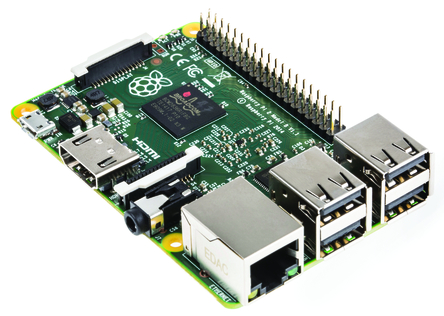
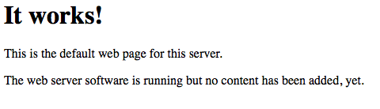

# Raspberry Pi Personal Web Server
I created a personal web server to display the control panel of my home automation server using a Raspberry Pi.

What is needed:

* Raspberry Pi (I used the RPi 2 Model B:)
  
  
* An internet connection
* A way to connect the RPi to the internet (via ethernet or wifi dongle)
* A way to power your RPi
* Access to your router settings

Things that are cool but aren't needed:

* Secure Shell (SSH) access to your RPi
* A registered domain name
* Dynamic DNS service (explained later)

**If you haven't set up your RPi yet, you'll need to grab an SD or microSD card and a keyboard, mouse, and monitor and install an operating system on your Raspberry Pi. I use and recommend Raspbian, but it is possible to set up a web server on any Raspberry Pi operating system. You can follow the directions [here] (https://www.raspberrypi.org/help/noobs-setup/) to install Raspbian.

If you need a more general setup guide or some more help setting up your RPi, go [here] (https://www.raspberrypi.org/help/quick-start-guide/). 

#Setup Instructions:

* Make sure everything is up to date by running:

  ```
  sudo apt-get update
  sudo apt-get upgrade
  ```
  
**Installing Web Server software:**

*   I set up my web server using Apache Web server software during my intial setup. It is quick and fast and is a good way to  test if everything is running properly. You can install node.js, nginx, or other web server software once you have tested that all your networking and basic setup is working (node.js in particular takes a few hours to compile and install and is not an efficient way to start). Run the following command to install apache, php, and a library that help Apache work with PHP:

  ```
  sudo apt-get install apache2 php5 libapache2-mod-php5
  ```

*   Once Apache is finished installing, go to your web browser (on the RPi or a computer attached to the same network) and type in your RPi's local IP address. To find this ip address, run `ifconfig` and look for *inet address*. This number is your RPi's local IP address. If there were no issues with your setup, a basic web site should load that looks like this:
   
  

  If nothing shows up, restart the apache service using the following command:

  ```
  sudo service apache2 restart
  ```

  If it still does not work, try uninstalling and reinstalling apache using the following commands:

  ```
  sudo apt-get --purge remove apache2 php5 libapache2-mod-php5
  sudo apt-get autoremove --purge
  sudo apt-get install apache2 php5 libapache2-mod-php5
  ```

   This website is located in `/var/www` and you can edit the `index.html` and add other files in this directory.

**Getting it Online:**

*This section will vary for everyone depending on your router and internet service provider.*

* Right now, this website can only be accessed by a device on the local area network. To get this on the world wide internet network, you'll need to enable inbound traffic at port 80 (the standard http port) of your raspberry pi through your router settings page (commonly accessed by enetering the gateway address of your network).

   If your internet service provider does not allow inbound traffic at port 80 for some reason, you'll need to enable port forwarding on your router and forward all traffic at port 80 of your raspberry pi to port 8080 (or some other random port).

   This is the most independent section of this guide; you'll need to search up how to enable inbound traffic or port forwarding for your specific router and ISP configuration. Don't worry, there are plenty of guides online if you search on any search engine.

**Getting a Domain Name**

* If you were able to get through the last step, your website is now accessible from the world wide internet network... if someone has your RPi's external facing IP address. To enable other people to access your website using a xxx.domain.xxx (a much more conventional method), we will use a dynamic domain name server (dynamic DNS) service.

   To explain a little more, all websites with domain names are linked to an IP address where the website is hosted. Many big companies have a server or set of servers with **static IP addresses** (an IP address that never changes) where they host their website. In this case, the company can just go to their domain provider (GoDaddy, Namecheap, etc) and link a purchased domain to their static IP in the domain settings online. However, static IP addresses are expensive, and trust me, if you are reading this guide you **DO NOT NEED** a static IP address no matter what you think. They are too expensive and not necessary at all (for our purposes).
   
   In our case, our internet service provider allows our devices to lease an IP address for a set amount of time. This IP can change whenever the ISP's servers feel like it is necessary, so we need a dynamic DNS service to act as a nameserver and keep track of these IP address changes and change the IP address in the domain settings accordingly.
   
   **100% Free Method:**

   *This section is only for those who do not have a domain name already registered and just want some sort of readable domain (this name will not be pretty). If you want to use a personally registered domain (something you registered or will register on GoDaddy, Namecheap, etc), skip to the section labeled "Dynamic DNS for Registered Domains".*
   
   There are many different free dynamic DNS websites (DNSdynamic and No-IP to name a few). I'll explain how to use [DNSdynamic](www.dnsdynamic.org) because I think it is the one that takes the least effort.

      1. Sign up for DNSdynamic at www.dnsdynamic.org and secure an available domain (it will look something like xxxxxxxx.dnsdynamic.org"
      2. DNSdynamic will tell you your current external facing IP address. If you are signing up from a computer different than the Raspberry Pi, then make sure to find the external facing IP address of your raspberry pi (using something like http://www.whatsmyip.org) and enter that IP address in the boxes.
      3. At this point, your dnsdynamic.org address isn't really dynamic. If your IP changes, nothing is currently updating that into the dnsdynamic.org database (unless you do it by hand). To fix this, download [ddclient](http://sourceforge.net/p/ddclient/wiki/Home/) onto your Raspberry Pi and follow the instructions on that website to configure it onto your Raspberry Pi.
      4. Once that is complete, wait for about an hour (this is VERY much on the safe side, a lot of times it just takes a few minutes for everything to work) and check your xxxxx.dnsdynamic.org website to make sure that the website currently in your `/var/www` directory on your Raspberry Pi is loaded in your web browser.

   **Dynamic DNS for Registered Domains**

   There are many different paid dynamic DNS websites (which is what you will need if you want to use your own domain). I'll explain how to use [No-IP](www.noip.com) because it's the one I ended up using.

      1. 
